Modern enterprises are adopting AI coding assistants to accelerate integration development. IBM Bob, combined with IBM WebMethods Hybrid Integration (IWHI), provides a powerful solution for rapidly developing and deploying IBM App Connect Enterprise (ACE) integration projects.

This tutorial demonstrates how to use IBM Bob's custom ACE Developer mode to generate complete integration projects from natural language prompts, compile them into BAR file, deploy onto local ACE integration server and test from within the Bob's IDE. After this validate the generated project locally using ACE Toolkit, modify/update as needed, and deploy them to managed ACE runtimes through IWHI Hybrid Control Plane.

You will implement an end-to-end workflow where AI generates integration code following enterprise patterns, local validation ensures quality, and centralized deployment provides governance and auditability.


The ACE Developer mode is a custom mode for IBM Bob that enables enterprise-grade development of IBM App Connect Enterprise (ACE) v13 integration solutions. This mode combines IBM's [ace-bob](https://github.com/ot4i/ace-bob) skill with enterprise-specific best practices, patterns, and guidelines to ensure all generated ACE artifacts align with organizational standards. You can customize this mode to align with your enterprise best practices and guidelines for ACE development. 


## Prerequisites

Before starting, ensure you have access to the following:

- IBM Bob IDE - [Installation instructions](https://bob.ibm.com/docs/ide/getting-started/install)
- IBM ACE Toolkit - [Download and installation guide](https://www.ibm.com/docs/en/app-connect/13.0.x?topic=gsace-download-app-connect-enterprise-evaluation-edition-get-started)
- IBM ACE runtime on Linux VM - [Installation instructions](https://www.ibm.com/docs/en/app-connect/13.0.x?topic=software-installing-linux)
- IBM WebMethods Hybrid Integration (IWHI) instance
- ACE Developer Bob mode- We have already created a custom [ACE developer mode](https://github.com/ibm-self-serve-assets/ibm-ace-bob-mode) to complete this tutorial. You can further customize this mode to align with your enterprise best practices and guidelines.
- ace-bob skill: Doenload ace-bob skill from [here](https://github.com/ot4i/ace-bob)


Also make sure that you have configured 'mqsiprofile' for command line environment on your local. This will be used by Bob to compile the created ACE project into BAR file for deployment. If you are using Macbook, you can use command similar to below in your terminal (Replace ACE installation location with your ACE installation). 


    ```bash
    echo 'source "/Applications/IBM App Connect Enterprise/server/bin/mqsiprofile"' >> ~/.bash_profile
    ```

Follow the documentation [here](https://www.ibm.com/docs/en/app-connect/13.0.x?topic=tasks-setting-up-command-environment) to configure command line environment.


If you do not have access to IBM WebMethods Hybrid Integration (IWHI) instance, you can still complete this tutorial except the IWHI part. In this case you can ignore Step 1 and Step 5.

You need these skills to complete this tutorial:

- Basic understanding of integration concepts
- Familiarity with REST APIs
- Basic understanding of AI coding workflows
- Basic ACE Toolkit usage


## Step 1. Manage ACE on VM with IWHI Hybrid Control plane

In this step, you will create an ACE Integration server on a Linux VM and register it with IWHI control plane. This will allow you to deploy and manage the created ACE integration project on the Linux VM.

### Create ACE Integration server on a Linux VM

For detailed instructions on how to install ACE and create integration server, follow the product documentation [here](https://www.ibm.com/docs/en/app-connect/13.0.x?topic=enterprise-installing-app-connect)

This step assumes that you have a Linux VM with IBM ACE runtime installed. If you don't have a Linux VM with IBM ACE runtime installed, you can follow the [installation instructions](https://www.ibm.com/docs/en/app-connect/13.0.x?topic=software-installing-linux).

If you already have a Linux VM with IBM ACE runtime installed, you can skip this step.

1. SSH into the Linux VM with sudo privileges.

2. Go to 'bin' directory of ACE installation directory. For example if you have installed ACE 13.0.7.1 in /opt/IBM/ace-13.0.7.1 directory, then go to:

    ```bash
    cd /opt/IBM/ace-13.0.7.1/server/bin
    ```

    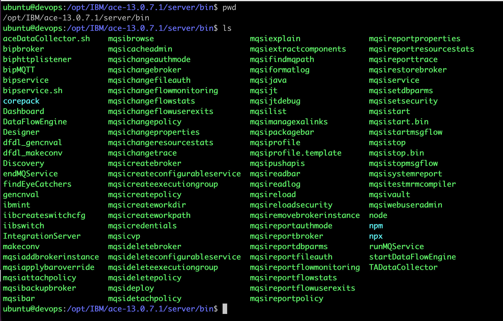

3. Run the mqsiprofile command to setup the ACE command line environment:

    ```bash
    source mqsiprofile
    ```

    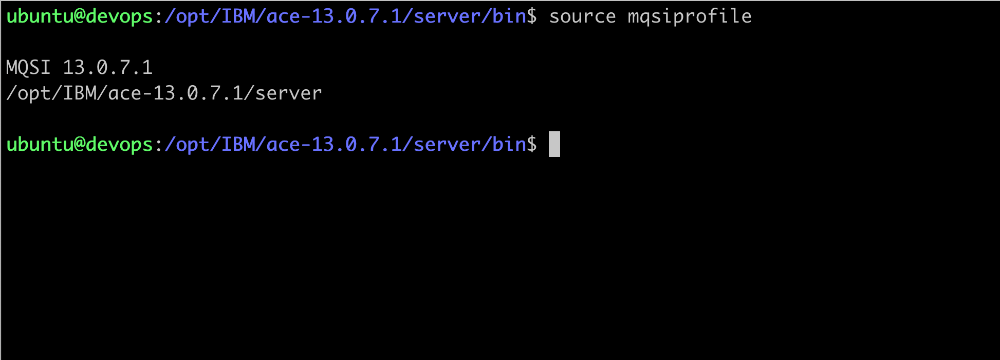

4. Create and start an ACE integration server using below command. Replace the work-dir with any directory of choice to store the ACE integration server data:

    ```bash
    IntegrationServer --name ace_demo --work-dir /data/ace/ace-demo-server&
    ```

    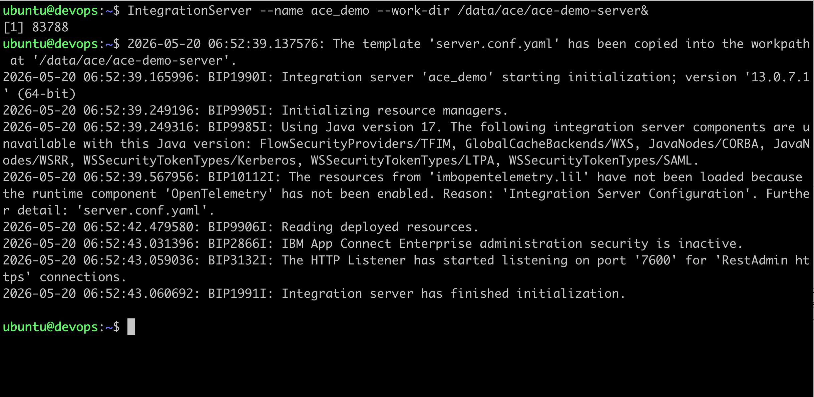

Now let us register this ACE integration server with IWHI Hybrid Control plane.

### Register ACE Integration server with IWHI Hybrid Control plane

1. Go to IWHI Hybrid Control Plane → Integration runtime management.

    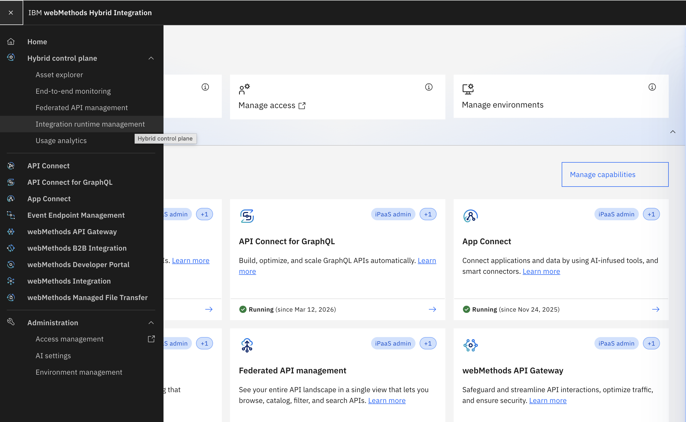

2. Click on 'register runtime' → 'Register App Connect runtimes'.

    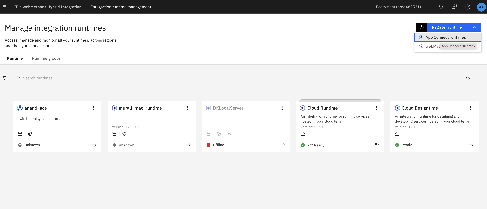

3. Click on 'Download configuration'.

    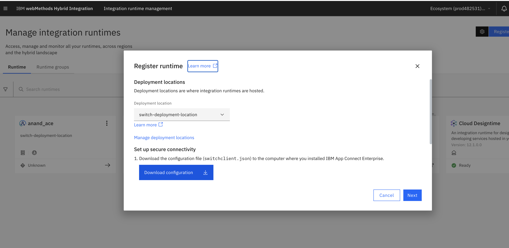

4. It would download 'switchclient.json' file on to your local machine. We need to put this switchclient.json file in the ACE integration server work directory (/ace-integration-server-working-dir/config/switch).

    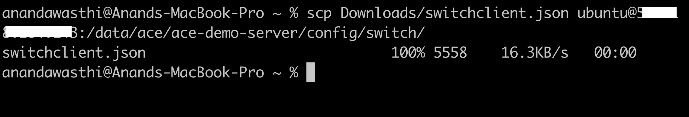

5. The integration server will automatically pick up the configuration file and register itself with IWHI Hybrid Control Plane.

    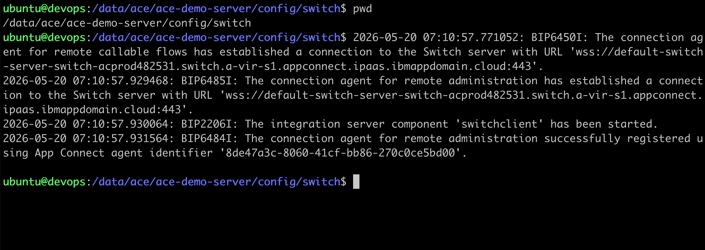

6. Check in IWHI Hybrid Control Plane → Integration runtime management → Registered runtimes.

    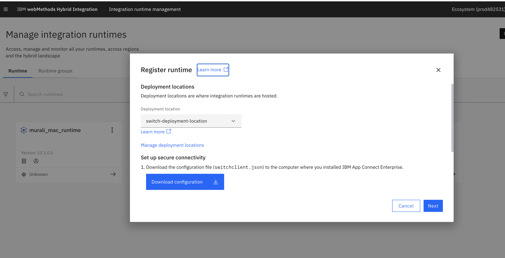

7. Click 'Next'.

    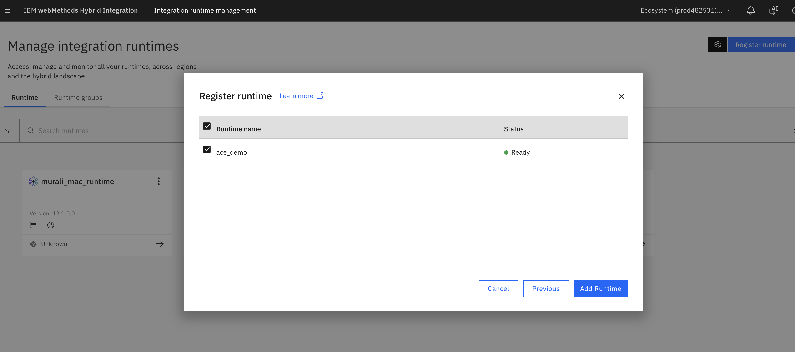

8. Select the runtime and click on 'Add runtime'.

    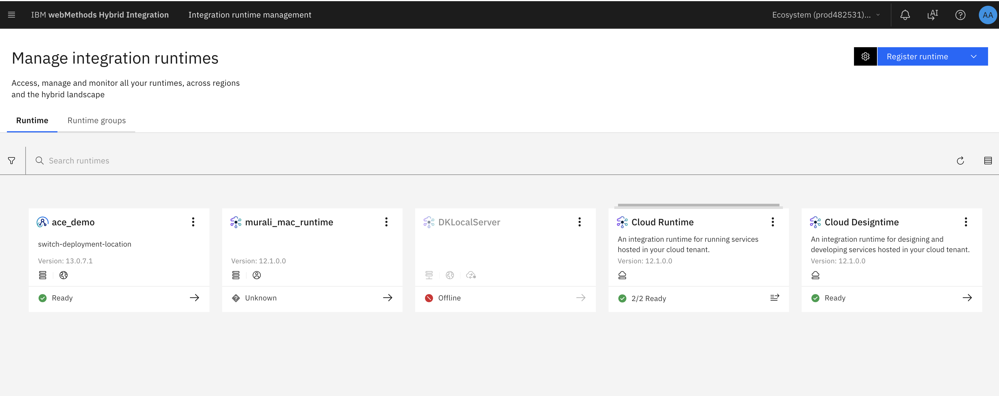

Now you are all set to manage this ACE integration server and deployed integrations from IWHI Hybrid Control Plane.

## Step 2. Import ACE developer mode

Download this custom ace-developer mode from [here](https://github.com/ibm-self-serve-assets/ibm-ace-bob-mode)

Copy the '.bob' folder into our IBM ACE workspace where we intend to create ACE projects. This makes the ACE Developer mode locally available in that specific workspace. However you can make it globally available by changing the mode scope to global and moving the rule and skill directories into the '.bob' in your home directory. Read more about Bob modes and skills [here](https://bob.ibm.com/docs/ide/configuration/custom-modes).

1. For example, here I have created an ACE workspace directory 'workspace2' and moved the '.bob' directory inside it:

    ```bash
    cp -R .bob /Users/anandawasthi/IBM/ACET13/workspace2
    ```

    ```bash
    ls -al /Users/anandawasthi/IBM/ACET13/workspace2
    ```

    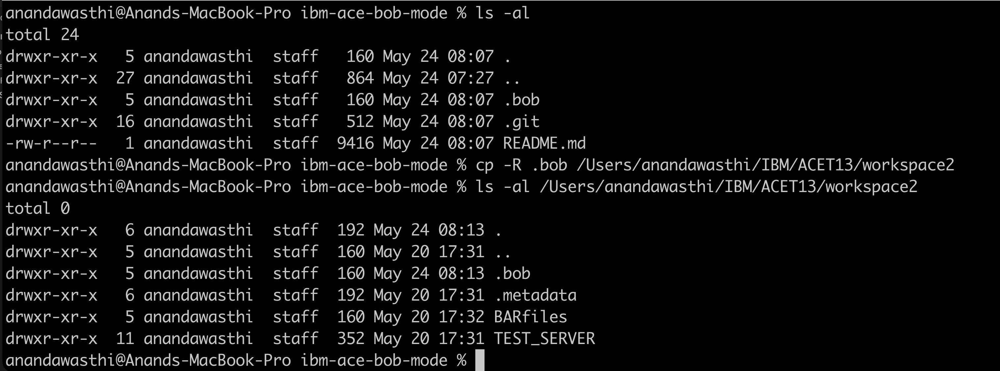


 Now install the ace-bob skill. Navigate to the '.bob' directory. If there is no 'skills' directory inside it, then create it and install the ace-bob skill inside the skills directory.


     ```bash
    mkdir skills
    cd skills
    git clone https://github.com/ot4i/ace-bob
    ```


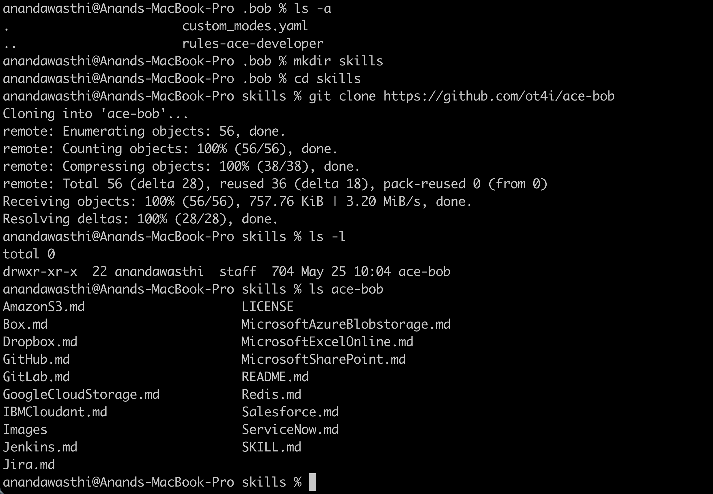


2. Now open the above ACE workspace folder in IBM Bob.

    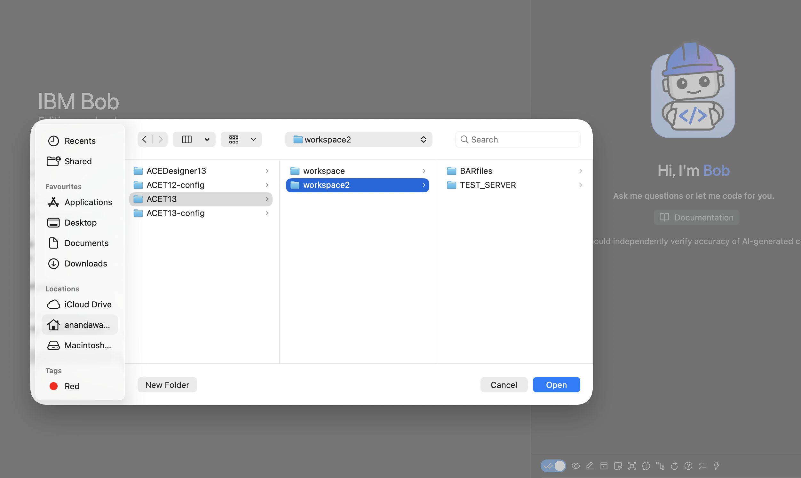

3. Now you should be able to see the '.bob' folder containing custom_modes.yaml and rule-ace-developer directory inside it.

    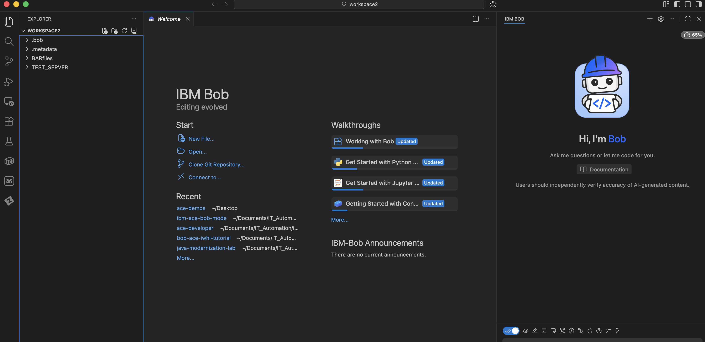

4. Check that you can see the 'ACE Developer' mode in mode dropdown.

    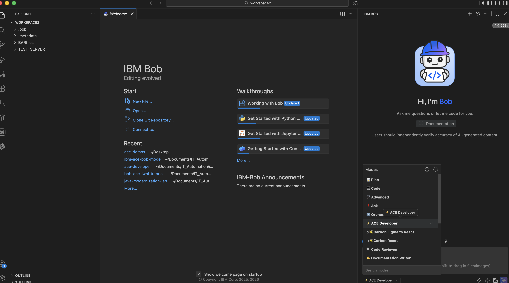

Now you will proceed with creating a new ACE project using Bob with a simple prompt.

## Step 3. Create ACE project with a prompt

Let us say you want to create a REST API in IBM ACE to check given cities' current weather and any alerts by leveraging an opensource API at the backend.

1. Select 'ACE Developer' mode.


    

2. Enter below prompt and hit enter. Provide approvals as prompted.

    ```
    Create a Weather API project for IBM ACE as per below specifications:
    - It exposes two GET methods, "current weather" and "alerts" over HTTP
    - Accepts a request parameter with the name "location" where we can pass city name
    - It calls the below backend opensource weather api url to get alerts and current weather:
            http://api.weatherapi.com/v1/alerts.json for alerts
            http://api.weatherapi.com/v1/current.json for current weather
            Passes below api key in query parameter with the name "key" while invoking above APIs
            8fdf10a32b9e44ca93633906260605
            Below are two working examples to call the above backend weatherapi from ACE flow:
    curl -X GET "http://api.weatherapi.com/v1/alerts.json?q=London&key=8fdf10a32b9e44ca93633906260605"
    curl -X GET "http://api.weatherapi.com/v1/current.json?q=London&key=8fdf10a32b9e44ca93633906260605"
    - It returns the json response as is what it received from the backed weatherapi
    ```


    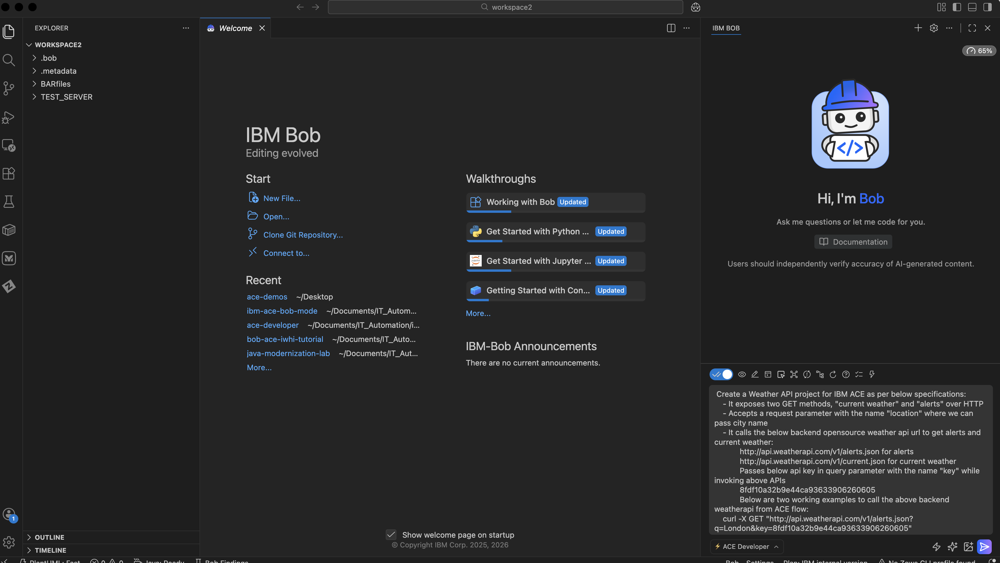


    Bob will start planning the next steps.


3. It would generate a todo list to perform and finish creating the ACE integration project for the REST API. It will also build, deploy and test it.


    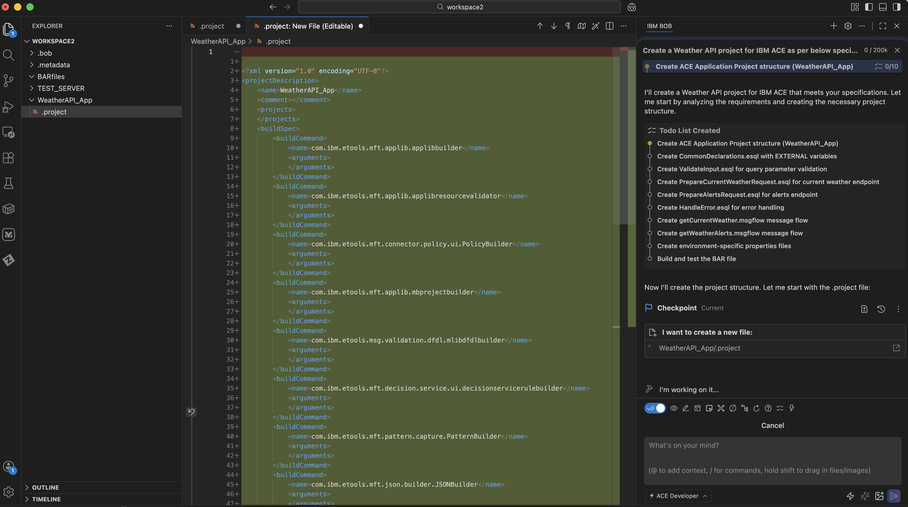


Keep providing approval as prompted. It would take few minutes to complete development, deploy onto local integration server and test it.


   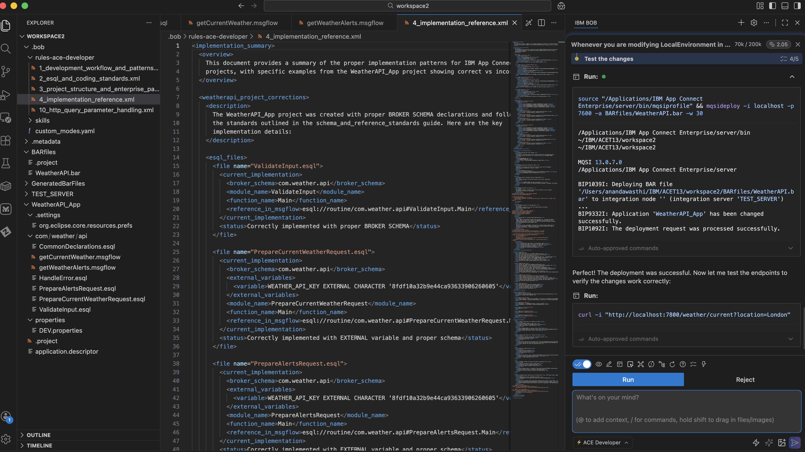


   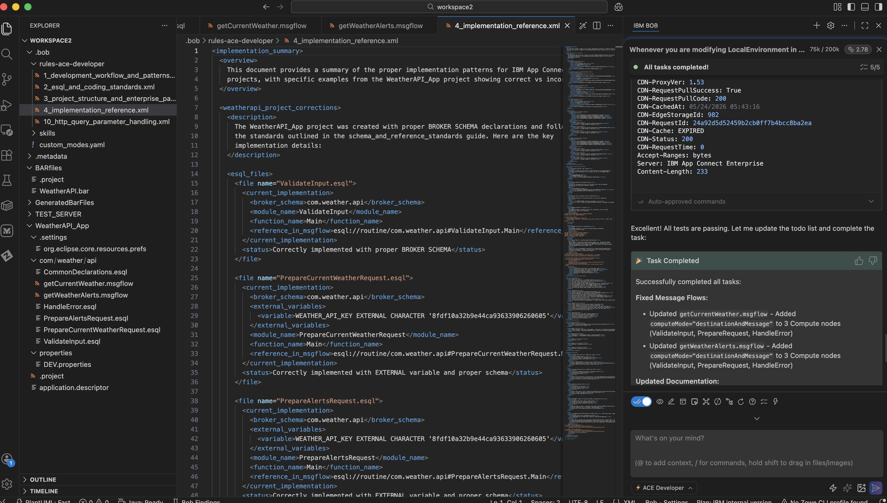


Let us now open this project in ACE Toolkit. We can further modify/update the generated project as per the requirements.


## Step 4. Validate and test created ACE project in ACE Toolkit

1. Open your integration workspace ACE Toolkit.


    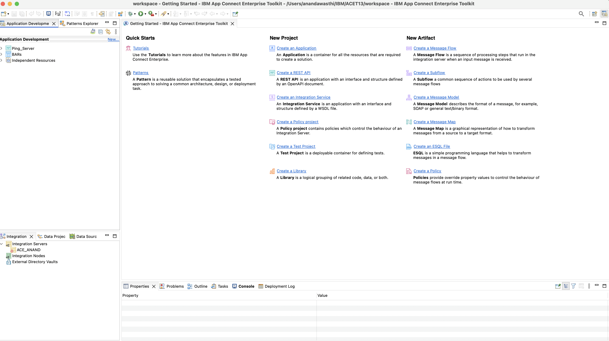


2. Open the 'WeatherAPI' project generated by Bob in Integration workspace in ACE Toolkit. Click on 'File' → 'Open projects from file system'.


    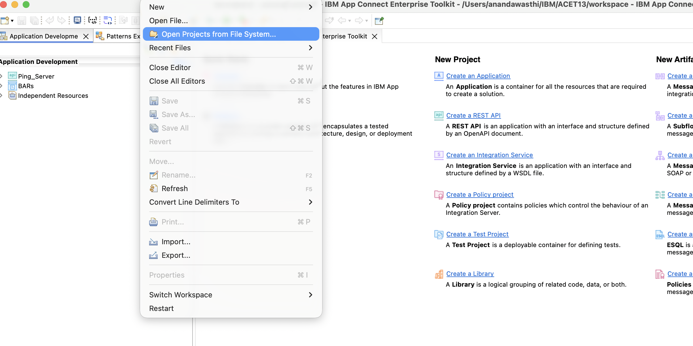


3. Select the 'WeatherAPI' project directory and click 'Open'.


    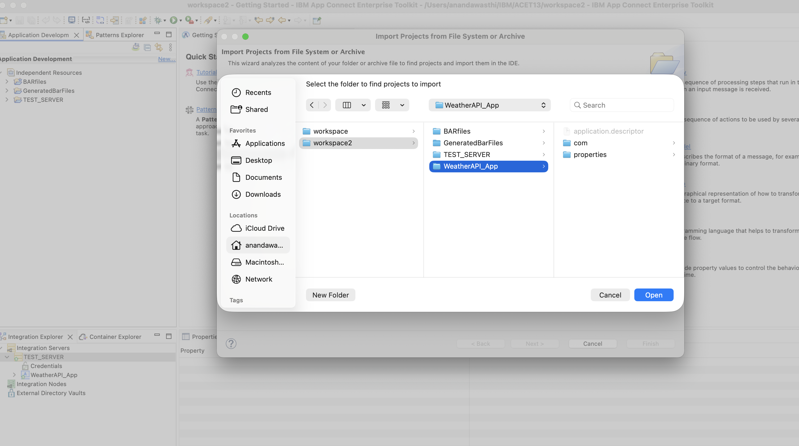


4. Click 'Finish'.


    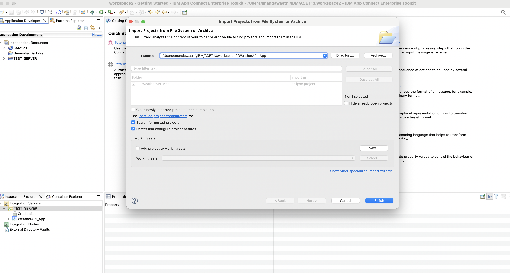


5. Now 'WeatherAPI' would be visible in 'Application Perspective' in left hand side of the window. You can also see that Bob already built and deployed it on the integration server


    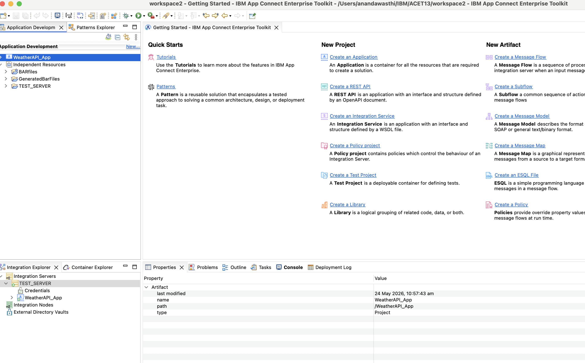


6. Now let us explore the 'WeatherAPI' project in 'Application Perspective'. Expand the 'WeatherAPI' project and explore the different components of the project, like message flows, subflows, ESQL code etc.


    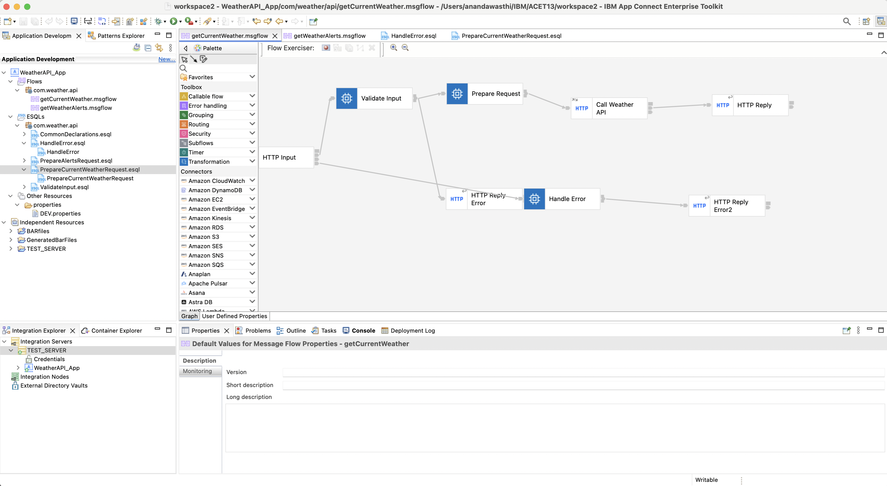


You can make further modifications to the project as needed and redeploy. Follow this [documentation](https://www.ibm.com/docs/en/app-connect/13.0.x?topic=solutions-deploying-integration-during-development) to learn more about deploying integrations solutions during development.


7. You should be able to see the 'WeatherAPI' deployed on the integration server. Click on it and scroll in properties tab to see the details, endpoints etc.


    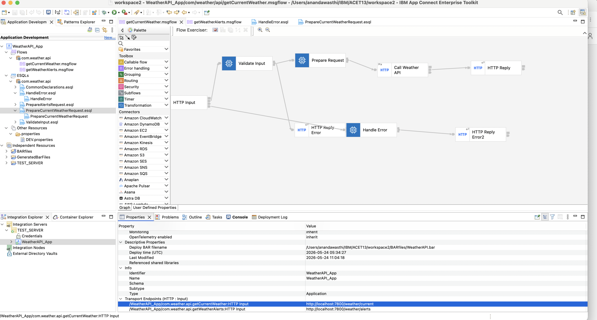


18. You can test the APIs by curl command or through the web browser:

    ```bash
    # Test current weather
    curl -X GET "http://localhost:7800/weather/current?location=London"
    
    # Test weather alerts
    curl -X GET "http://localhost:7800/weather/alerts?location=London"
    ```


This completes the local validation and testing of the ACE Integration project generated by IBM Bob. Now you will deploy this API on ACE runtime on Linux VM that is managed by IWHI.


## Step 5. Deploy the created ACE integration project through IWHI Hybrid Control Plane

1. Go to the IWHI Hybrid control plane → Integration runtime management.


    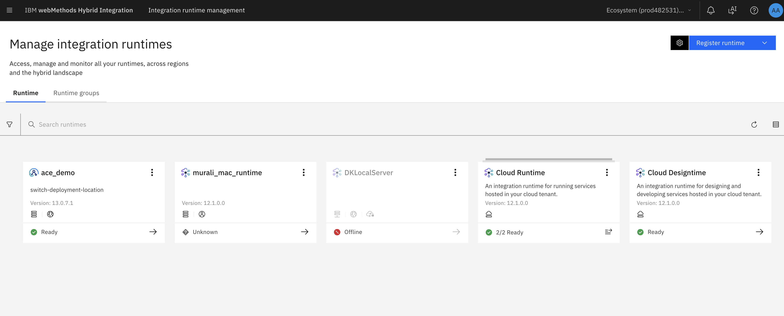


2. Click on the right arrow on your ace runtime instance, 'ace-demo' to open it. It will take you to admin UI of the ACE integration server.


    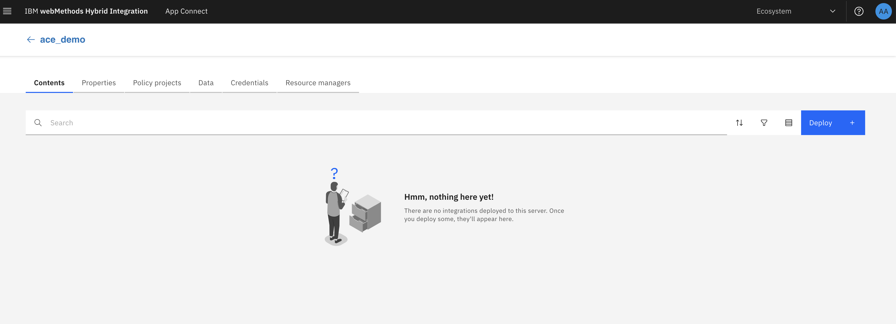


3. Click on Deploy → Add Bar file and select the Bar file from the ACE workspace.


    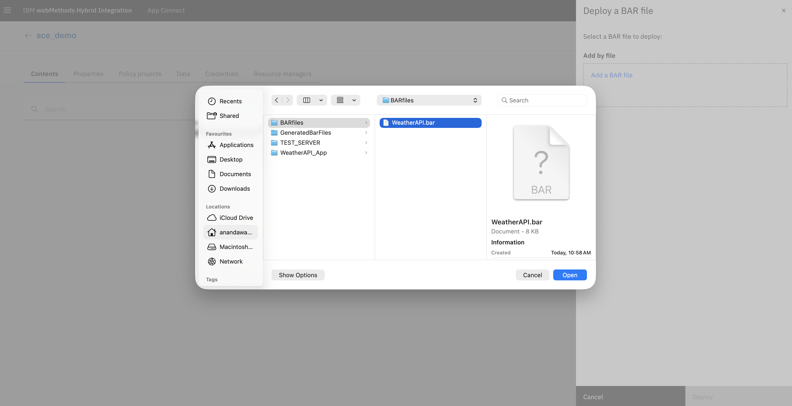


4. Click on Deploy.


    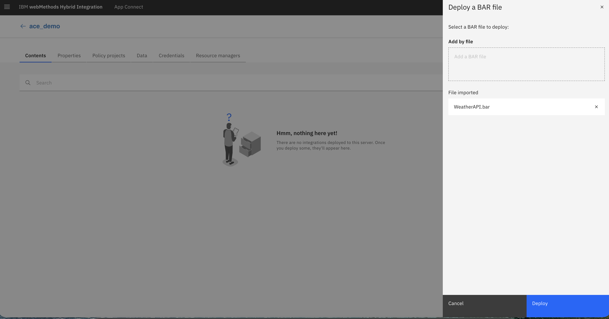


5. When successfully deployed, you will see the deployed API in the runtime.


    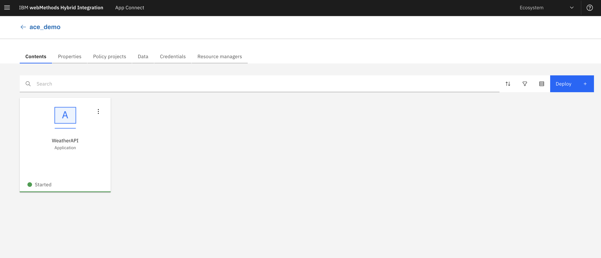


6. You can click on the deployed application and navigate to both the APIs to see the endpoint and any other details.


    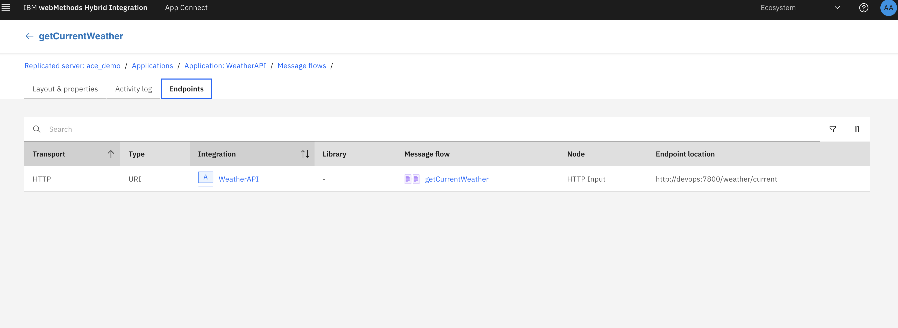


7. You can test the API similarly as explained in Step 4 by just replacing the endpoint hostname with the hostname/ip address of the Linux VM.

## Summary

This tutorial demonstrated an end-to-end AI-assisted integration development workflow that combines IBM Bob's generative AI capabilities with IWHI's centralized management to accelerate ACE project delivery while maintaining enterprise governance and control.

You successfully completed a comprehensive workflow spanning five key stages:

**1. Infrastructure Setup**: Configured IWHI Hybrid Control Plane to manage a self-managed ACE integration server on a Linux VM, establishing centralized control for deployment and lifecycle management of integration runtimes.

**2. AI Development Environment**: Imported and configured the custom ACE Developer mode in IBM Bob, enabling AI-assisted generation of enterprise-grade ACE integration projects that follow organizational best practices and patterns.

**3. Rapid Project Generation**: Used natural language prompts to generate a complete Weather API integration project with IBM Bob, including REST endpoints, backend service integration, message flows, and ESQL code - reducing development time from hours to minutes.

**4. Local Validation**: Validated the AI-generated project in ACE Toolkit, reviewed the generated artifacts (message flows, subflows, ESQL), tested the deployed APIs locally, and confirmed functionality before production deployment.

**5. Production Deployment**: Deployed the validated BAR file to the managed ACE runtime through IWHI Hybrid Control Plane, demonstrating centralized deployment with full auditability and governance.

The Weather API implementation showcased real-world integration patterns with two GET endpoints (current weather and alerts) that integrate with an external weather service, demonstrating how Bob generates production-ready code following ACE best practices.

This AI-assisted approach delivers significant benefits:

- **Development Acceleration**: Generate complete integration projects in minutes instead of hours
- **Quality Assurance**: AI follows enterprise patterns and best practices consistently
- **Governance**: Centralized deployment and management through IWHI Hybrid Control Plane
- **Flexibility**: Local validation before production deployment ensures quality
- **Auditability**: Full deployment tracking and runtime management visibility

### Next steps

- Explore advanced ACE integration patterns
- Extend Bob modes for additional integration use cases
- Implement CI/CD pipeline integration for automated deployments
- Configure monitoring and alerting through IWHI Hybrid Control Plane

## References

- [Using IBM Bob in the ACE Toolkit](https://community.ibm.com/community/user/blogs/ben-thompson1/2026/05/21/using-ibm-bob-in-the-ace-toolkit) - Learn how to use the ace-bob skill with bob-shell in the ACE Toolkit for enhanced integration development workflows.

---
